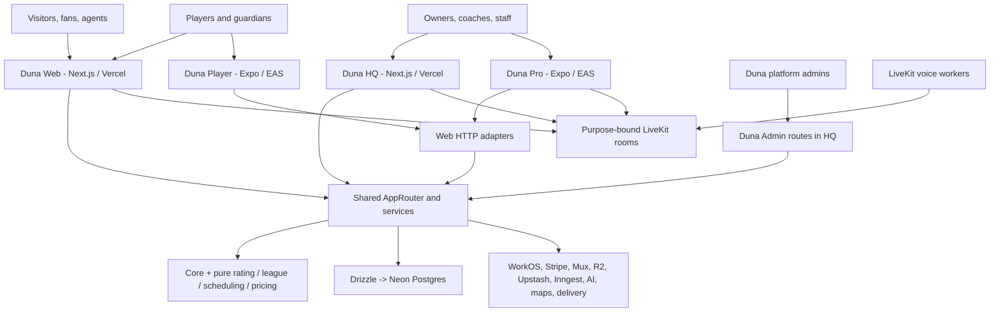

# Duna architecture

This document describes the durable system shape and engineering boundaries.
It is not a launch-readiness claim. Current implementation evidence and
external gates are tracked in [`BUILD_MATRIX.md`](BUILD_MATRIX.md); operational
procedures are in [`OPERATIONS.md`](OPERATIONS.md).

## System context

Duna is one platform projected into public/player web, operator web, platform
administration, two native apps, Watch/Live Activity targets, and private voice
workers. Shared TypeScript contracts and one Postgres model keep those
projections coherent.

## Runtime topology

| Runtime         | Source              | Deployment unit                                | Main ingress                                       | Guide                                                  |
| --------------- | ------------------- | ---------------------------------------------- | -------------------------------------------------- | ------------------------------------------------------ |
| Duna Web        | `apps/web`          | Vercel project `duna-web`                      | HTML, server actions, `/api/trpc`, protocol routes | [`surfaces/WEB.md`](surfaces/WEB.md)                   |
| Duna HQ         | `apps/hq`           | Vercel project `duna-hq`                       | HTML, server actions, cron/protocol routes         | [`surfaces/HQ.md`](surfaces/HQ.md)                     |
| Duna Admin      | `apps/hq/app/admin` | Same HQ deployment, separate authorization     | `/admin`                                           | [`surfaces/ADMIN.md`](surfaces/ADMIN.md)               |
| Duna Player     | `apps/player`       | EAS iOS/Android binary plus compatible updates | Native UI/deep links                               | [`surfaces/PLAYER.md`](surfaces/PLAYER.md)             |
| Duna Pro        | `apps/pro`          | EAS iOS/Android binary plus compatible updates | Native UI/deep links                               | [`surfaces/PRO.md`](surfaces/PRO.md)                   |
| Voice workers   | `apps/voice-agent`  | Long-running LiveKit-compatible worker         | LiveKit agent dispatch                             | [`surfaces/VOICE_AGENTS.md`](surfaces/VOICE_AGENTS.md) |
| Shared platform | `packages/*`        | Bundled into consuming runtimes                | In-process caller or Web HTTP adapters             | [`surfaces/PLATFORM.md`](surfaces/PLATFORM.md)         |

There is no independently deployed REST backend. Web and HQ bundle
`packages/api` and invoke it in process. Web additionally exposes the router and
protocol-specific handlers to native/public clients.

## Request paths

### Browser render or server action

1. Next.js receives the request.
2. `apps/web/lib/api.ts` or `apps/hq/lib/api.ts` resolves the request/session.
3. WorkOS identity, organization membership, platform role, guardianship, and
   scopes become an `ApiActor`.
4. An in-process typed caller invokes the shared `AppRouter`.
5. The procedure validates input, applies authorization/rate/idempotency policy,
   and calls the owning service/repository.
6. The response is validated and projected into the page.

### Native request

1. Player/Pro opens WorkOS authorization in the system browser using PKCE.
2. Web exchanges the code; the native app stores the short-lived session in
   encrypted SecureStore.
3. `mobile-api.ts` calls Web `/api/trpc` or a protocol route with the bearer
   token.
4. Web creates the same server-side actor/context and executes the same
   procedure as a browser surface.

Native clients do not receive database, Stripe, WorkOS secret, LiveKit secret,
R2 secret, or Upstash credentials.

### Provider webhook or durable job

1. The route verifies the provider signature before interpreting the payload.
2. The raw event/reference is deduplicated and committed to Neon.
3. A durable workflow job is committed in the same data plane.
4. Inngest dispatch/recovery performs side effects idempotently.
5. Provider state is re-read before Duna posts final money/delivery truth.

An unavailable dispatcher must not make signed ingress lossy.

### Messaging delivery

1. The server revalidates relationship, block, participant, guardian, and
   moderation policy.
2. It appends the message, sequence, participant state, and audit evidence in a
   Neon transaction using the stable client UUID.
3. It publishes a content-free wake hint through Upstash after commit.
4. Web/native clients gap-fill from authenticated Neon cursor endpoints.
5. Native push and SQLite outbox behavior preserve the same message ID.

Upstash, SSE, and push reduce latency. They are never message correctness or
authorization truth. See [`MESSAGING_PLATFORM.md`](MESSAGING_PLATFORM.md) and
[`adr/ADR-003-owned-messaging-delivery.md`](adr/ADR-003-owned-messaging-delivery.md).

### Voice draft

1. Web/HQ rechecks the household or organization/session relation.
2. It issues a short-lived, purpose-bound LiveKit room token.
3. The named voice worker receives minimal metadata and produces a transcript
   or recap.
4. The user reviews and saves through an ordinary typed mutation.
5. Share/publish remains a separate explicit action.

## Identity, tenancy, and authorization

WorkOS provides authenticated user and organization identity. Duna remains the
authority for product person records, guardianship, organization memberships,
platform roles, scopes, age state, audit, and resource relationships.

The context resolver may synchronize a known WorkOS user/organization into
Duna, but it grants only mapped active roles. Selecting or sending an
organization ID does not grant access. Every organization query is scoped
before execution, and every Admin procedure checks the persisted platform role.

Role groups:

- Player and guardian roles receive player/profile/booking/wallet/social scopes.
- Each organization has one active Owner, represented by the organization
  `owner` role. Directors are staff-profile roles with an active manager
  membership plus Director scopes; they do not create additional Owners.
  Ownership transfers explicitly from the current Owner to an active Director.
  Directors receive financial-configuration access; payment collection is a
  separate, narrower capability for coaches and front-desk staff. Organization
  ownership is broad only within its own organization, never the platform.
- Admin and Super Admin are platform roles, separate from organization roles.
- Demo actors exist only for explicit unconnected development/test behavior.

Client-side route guards and hidden navigation are usability only. Procedure
authorization is the security boundary.

## Typed API and protocol adapters

The `AppRouter` has `public`, `player`, `operator`, `messaging`, `agent`, and
`admin` namespaces. Zod validates all procedure inputs and outputs. Risky
mutations add idempotency, audit, confirmation, and rate limits as required.

Use tRPC for product queries/mutations. Add a route handler only when the
protocol requires one, for example:

- signed Stripe/Mux webhooks;
- OAuth code exchange/refresh;
- MCP Streamable HTTP;
- SSE messaging wakeups;
- multipart/presigned media upload;
- LiveKit participant token issuance;
- Inngest serving;
- Apple Wallet files;
- cron authorization.

External agents use the typed public/authenticated API or MCP. They never
receive Neon credentials or direct repair SQL.

## Truth and persistence

Neon Postgres is the application system of record. Drizzle schema and
forward-only SQL migrations live in `packages/db`.

| Domain               | Canonical truth                                                                             |
| -------------------- | ------------------------------------------------------------------------------------------- |
| Identity and tenancy | People, WorkOS mapping, active memberships, guardianship, Admin roles                       |
| Competition          | Append-only rally events, confirmations, teams/matches/brackets                             |
| Sand Rating          | Versioned configuration, append-only rating events, chronological projection/backtests      |
| Imports              | Source provenance, raw payload/evidence, checkpoints, mappings, ambiguity, approval         |
| Commerce             | Orders and Duna ledgers reconciled to Stripe objects/webhooks                               |
| Wallet/credits       | Immutable journals and entries; custody rules remain server/provider controlled             |
| Booking/ticketing    | Holds, bookings, policy acceptances, registrations, scan ledger                             |
| Messaging            | Conversation-local sequence, stable client UUID, participant state, moderation, attachments |
| Video/Vision         | Duna metadata/authorization; Mux/R2 own media transport objects                             |
| Health               | Minimized metadata plus encrypted AES-GCM payload; owner grants revalidated on read         |
| Workflows            | Deduplicated webhook events and durable job state                                           |
| Administration       | Immutable audit records and scoped feature flags                                            |

Primary access uses the Neon HTTP Drizzle client exposed by `getDatabase()`.
Atomic multi-step changes use the serverless transactional client. Eligible
latency-tolerant reads use `getReadOnlyDatabase()`, which connects through
`NEON_READ_ONLY_REPLICA` and falls back to the primary outside production when
the replica is not configured. Because a replica can lag, authorization,
payments, inventory/capacity, registration, live state, messaging cursors, and
read-after-write flows remain on the primary. Audit evidence that explains a
mutation is committed with that mutation.

## Deterministic engines

Rating, league/scoring, scheduling, and pricing packages are pure. They do not
import a clock, network, database, environment, or ambient randomness. The API
loads explicit inputs, calls the engine, and persists the result/evidence.

This separation enables replay and prevents a UI or provider retry from
silently changing calculation rules.

## Money boundary

Duna never treats a client response as payment success and does not make an
internal balance override Stripe custody truth. The server owns amount,
currency, fee policy, destination, order link, and idempotency. It creates or
reads the Stripe object, verifies provider state, then appends the Duna ledger
evidence.

All money is integer minor units with an explicit ISO currency. Refunds and
reader retries remain attached to the original order/payment attempt.

## AI boundary

AI providers may summarize evidence and create drafts. They do not directly:

- send messages;
- publish content or event changes;
- move money or set prices;
- merge identities or approve claims;
- activate a rating model;
- waive guardian/safety policy;
- mutate provider or database state outside a typed confirmed tool.

High-risk actions require a fresh human confirmation tied to the current draft
hash/nonce, actor, and target. Minor messaging additionally fails closed on the
documented consent and data-retention gates.

## Connected providers

Provider adapters are optional by environment and should degrade explicitly:

- WorkOS: identity and organization sessions;
- Stripe: Checkout, Connect, Identity, Terminal, subscriptions, refunds;
- Neon: application data and shared rate/idempotency state;
- Upstash: messaging wake hints only;
- Inngest: durable workflow dispatch/recovery;
- Mux and Cloudflare R2: live/video and private originals/attachments;
- LiveKit: short-lived voice rooms and workers;
- Vercel AI Gateway/OpenAI Agents: bounded model work;
- Mapbox, Google Places/Routes, Tomorrow.io: planning and location context;
- Expo/APNs, Knock, Resend, Sent, Twilio: user-authorized delivery;
- Sentry, Axiom, PostHog: environment-specific observability.

Exact storage locations, access checks, and variable names are in
[`INFRASTRUCTURE.md`](INFRASTRUCTURE.md) and
[`ENVIRONMENT_VARIABLES.md`](ENVIRONMENT_VARIABLES.md).

## Demo and connected modes

The deterministic demo adapter keeps the product navigable without external
credentials. It is not a mock of live provider health. Connected deployments
set `DUNA_DATA_SOURCE=database` and must fail visibly when required data or a
provider is unavailable; they must not silently render demo business truth.

Tests should name which mode they prove. A demo browser test cannot prove
tenant isolation in Neon, and a connected API smoke cannot prove a native
entitlement or store build.

## Architectural invariants

1. Rally events are scoring truth; rating events are rating truth; ledger
   entries are balance truth.
2. Product mutations enter through the typed procedure layer.
3. Organization scope and permissions are enforced before query execution.
4. Mutations are idempotent and external side effects recover durably.
5. Stripe-managed balances and objects remain money/custody truth.
6. Money, rating, eligibility override, role, and platform actions are audited
   with the mutation.
7. Guardian, custodial, age, consent, and minors-safety rules are server rules.
8. AI reads/proposes; humans freshly confirm high-risk actions.
9. Currency uses integer minor units; stored time is UTC and rendered in local
   context.
10. Pure engines do not depend on clocks, networks, databases, environment, or
    ambient randomness.
11. Neon cursor reads own messaging convergence; Upstash/push are hints.
12. Public/native variables are public and never contain secrets.

## Change and release boundaries

A code merge, migration, Vercel deployment, healthy endpoint, authenticated UI
check, native export, signed build, store upload, store processing, and provider
approval are different pieces of evidence. Report each one independently.

When architecture changes, update this document, the target surface guide, and
any affected environment/infrastructure/specialist guide in the same pull
request.
