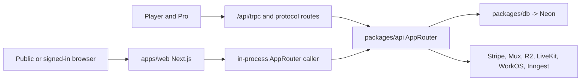

# Duna Web

`apps/web` is both Duna's public/player product and the network API host used by
the native apps. It deploys as the Vercel project `suttonx/duna-web` with project
root `apps/web`.

## Product ownership

Duna Web owns:

- the editorial homepage and public brand/knowledge pages;
- public discovery, venues, clubs, coaches, players, events, rankings, matches,
  live scoring, professional coverage, and video playback;
- the signed-in Player web shell: home, discovery, planning, scoring, matches,
  health, profile, settings, messaging, wallet, predictions, pickup, and
  checkout;
- invitation and claim links for guardians, organizations, teams, bookings, and
  match participants;
- the canonical tRPC HTTP endpoint used by Player and Pro;
- mobile WorkOS authorization-code exchange and refresh endpoints;
- public MCP, deterministic Markdown representations, sitemap, structured data,
  and agent navigation;
- provider ingress for Stripe, Mux, Inngest, messaging, media, and scheduled
  player-source refreshes.

It does not own dense operator administration (HQ), global platform control
(Admin), or native device behavior (Player/Pro).

## Route families

| Family              | Representative routes                                                                                        | Owning source                                |
| ------------------- | ------------------------------------------------------------------------------------------------------------ | -------------------------------------------- |
| Editorial and trust | `/`, `/about`, `/safety`, `/legal`, `/methodology`                                                           | `apps/web/app`                               |
| Public network      | `/discover`, `/venues/[venueId]`, `/clubs/[slug]`, `/coaches/[handle]`, `/players/[handle]`                  | `apps/web/app`, public procedures            |
| Competition         | `/events/[slug]`, `/matches/[matchId]`, `/live/[matchId]`, `/rankings`, `/pro`, `/pro/teams/[teamNo]`        | `apps/web/app`, rating/pro data services     |
| Player shell        | `/app`, `/app/discover`, `/app/play`, `/app/matches`, `/app/score`, `/app/profile`, `/app/settings`          | `apps/web/app/app`, `player-shell.tsx`       |
| Player services     | `/app/health`, `/app/messages`, `/app/wallet`, `/app/wallet/predictions`, `/app/pickup/*`, `/app/checkout/*` | `apps/web/app/app`, shared API services      |
| Invitations         | `/join/guardian/*`, `/join/organization/*`, `/join/team/*`, `/join/match/*`, `/app/booking-invite/*`         | Server actions and typed mutations           |
| Machine-readable    | `/agents`, `/llms.txt`, `/api/public-markdown`, `/api/mcp`, sitemap/robots                                   | Route handlers and `docs/MCP.md`             |
| Network API         | `/api/trpc`, `/api/auth/mobile/*`, `/api/messaging/*`, `/api/health`                                         | Route handlers backed by `packages/api`      |
| Provider ingress    | `/api/stripe/webhook`, `/api/mux/webhook`, `/api/inngest`                                                    | Signed handlers and durable workflow records |
| Media and live      | `/api/player-media/*`, `/api/video/*`, `/api/livekit/token`, `/api/pro-matches/*/live`                       | API/media/LiveKit adapters                   |

The file tree is the route source of truth. Search it before adding a new route:

```bash
find apps/web/app -name 'page.tsx' -o -name 'route.ts' | sort
```

## Runtime architecture

Server components and server actions call `getServerCaller()` in
`apps/web/lib/api.ts`. That helper resolves the WorkOS session and creates an
in-process caller for `packages/api/src/router.ts`; there is no second internal
backend hop.

`apps/web/app/api/trpc/[trpc]/route.ts` exposes the same `AppRouter` over HTTP.
Native clients and external typed clients call this endpoint. Adjacent route
handlers exist only where a protocol is not naturally tRPC: webhooks, SSE,
multipart uploads, OAuth exchange, LiveKit tokens, wallet files, MCP, and
Inngest.



## Identity and authorization

- Public procedures return deliberately public projections; they do not expose
  minors or private profiles.
- Browser identity is WorkOS AuthKit when configured. Unconfigured local work
  may use the explicit demo actor.
- Mobile endpoints accept a WorkOS bearer token obtained through PKCE. Refresh
  tokens stay in native SecureStore and are never sent to tRPC procedures.
- Organization context and platform roles are resolved on the server. Route
  parameters and request bodies do not grant tenancy.
- Player mutations must use `player.*`; organization work uses `operator.*`;
  global controls use `admin.*`.

See [`../API.md`](../API.md) and [`PLATFORM.md`](PLATFORM.md).

## Public knowledge contract

Every indexable public route in the sitemap has one canonical HTML URL and a
deterministic Markdown representation. Public facts, JSON-LD, and Markdown must
agree. Missing data is represented as unknown or pending, not zero or inferred.
Registration, booking, purchase, and other mutations always return users to the
authenticated product flow.

The binding rules live in [`../../AGENTS.md`](../../AGENTS.md) under “Public
knowledge, SEO, AEO, and agent access.”

## Where to change code

| Need                                 | Location                               |
| ------------------------------------ | -------------------------------------- |
| Page/layout/metadata                 | `apps/web/app/**`                      |
| Reusable web interaction             | `apps/web/components/**`               |
| Web-only view helper                 | `apps/web/lib/**`                      |
| Authentication or API contract       | `packages/api`, then the route adapter |
| Persistent schema/transaction        | `packages/db`, then `packages/api`     |
| Shared presentation or tokens        | `packages/ui`                          |
| Native behavior for the same journey | `apps/player` or `apps/pro`            |

Avoid putting business truth in a server action or component. The page should
translate a typed procedure result into a view; shared policy stays in the API
or pure domain package.

Waiver signing is an inline, scroll-gated, typed-name flow. The payment path is
never blocked by a participation waiver; the server-owned waiver requirement is
presented after a confirmed purchase and gates participation instead. See
[`../WAIVERS_AND_RELEASES.md`](../WAIVERS_AND_RELEASES.md).

## Local development

```bash
pnpm dev:web
```

The app runs on `http://localhost:3000`. For a connected environment, place the
required names from [`../ENVIRONMENT_VARIABLES.md`](../ENVIRONMENT_VARIABLES.md)
in ignored `apps/web/.env.local`. Keep `NEXT_PUBLIC_*` values non-secret. The
API host needs `DUNA_DATA_SOURCE=database` and `DATABASE_URL` for connected
truth; otherwise the repository can intentionally select demo data.

## Validation and release

```bash
pnpm --filter @duna/web lint
pnpm --filter @duna/web typecheck
pnpm --filter @duna/web test
pnpm --filter @duna/web build
pnpm test:e2e
```

Before calling Web released, verify the exact source commit in the Vercel
deployment, `/api/health`, public and authenticated routes, the relevant
provider webhook or media path, and desktop/tablet/mobile layouts. A successful
HQ deployment is separate evidence.

Provider access and exact commands are in
[`../INFRASTRUCTURE.md`](../INFRASTRUCTURE.md).
